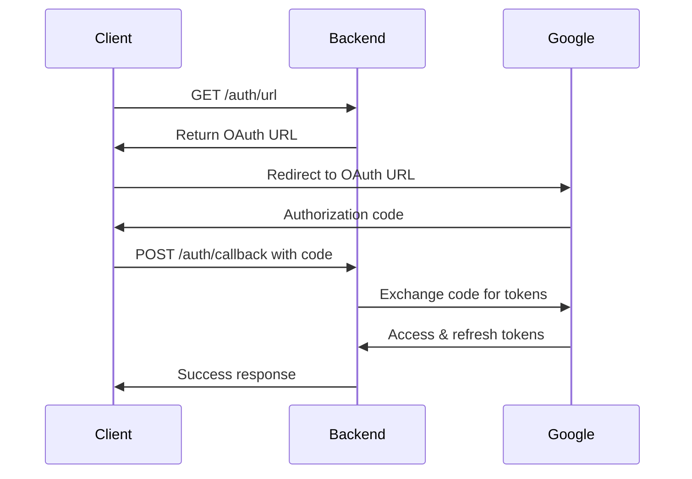

# ClickGuard Backend - Technical Documentation

## Table of Contents

1. [Architecture Overview](#architecture-overview)
2. [Code Structure](#code-structure)
3. [API Implementation](#api-implementation)
4. [Authentication Flow](#authentication-flow)
5. [Google Ads Integration](#google-ads-integration)
6. [Tracker Module](#tracker-module)
7. [Security Implementation](#security-implementation)
8. [Error Handling](#error-handling)
9. [Performance Considerations](#performance-considerations)
10. [Development Guidelines](#development-guidelines)
11. [Deployment Architecture](#deployment-architecture)

## Architecture Overview

### System Architecture

The ClickGuard Backend follows a **modular, layered architecture** with clear separation of concerns:

```
┌─────────────────────────────────────────────────────────────┐
│                    Presentation Layer                       │
│  ┌─────────────────┐  ┌─────────────────┐  ┌──────────────┐ │
│  │   HTTP Routes   │  │  Middleware     │  │  Validation  │ │
│  └─────────────────┘  └─────────────────┘  └──────────────┘ │
└─────────────────────────────────────────────────────────────┘
┌─────────────────────────────────────────────────────────────┐
│                    Business Logic Layer                     │
│  ┌─────────────────┐  ┌─────────────────┐  ┌──────────────┐ │
│  │   Services      │  │  Controllers    │  │  Utilities   │ │
│  └─────────────────┘  └─────────────────┘  └──────────────┘ │
└─────────────────────────────────────────────────────────────┘
┌─────────────────────────────────────────────────────────────┐
│                    Data Access Layer                        │
│  ┌─────────────────┐  ┌─────────────────┐  ┌──────────────┐ │
│  │   API Clients   │  │  External APIs  │  │  File System │ │
│  └─────────────────┘  └─────────────────┘  └──────────────┘ │
└─────────────────────────────────────────────────────────────┘
```

### Design Patterns

1. **Module Pattern**: Each feature is encapsulated in its own module
2. **Service Layer Pattern**: Business logic is separated from route handlers
3. **Repository Pattern**: Data access is abstracted through client interfaces
4. **Middleware Pattern**: Cross-cutting concerns are handled by middleware

## Code Structure

### Directory Organization

```
apps/backend/
├── server.js                 # Application entry point
├── package.json              # Dependencies and scripts
├── .env                      # Environment variables (not in git)
├── .env.example              # Environment template
├── .gitignore                # Git ignore rules
└── src/
    ├── app.js                # Express application setup
    ├── modules/              # Feature modules
    │   └── google-ads/       # Google Ads integration module
    │       ├── api/          # API client layer
    │       │   ├── client.js     # Google Ads API client
    │       │   ├── customer.js   # Customer operations
    │       │   ├── report.js     # Report generation
    │       │   └── index.js      # Module exports
    │       ├── auth/         # Authentication layer
    │       │   ├── service.js    # OAuth2 service
    │       │   └── routes.js     # Auth routes
    │       ├── service.js    # Business logic service
    │       └── routes.js     # API routes
    ├── services/             # Shared business services
    ├── models/               # Data models
    ├── config/               # Configuration files
    ├── workers/              # Background workers
    ├── utils/                # Utility functions
    └── api/                  # API routes and controllers
```

### Module Structure

Each module follows a consistent structure:

```
module/
├── api/              # External API integration
├── auth/             # Authentication logic
├── service.js        # Business logic
├── routes.js         # HTTP routes
└── index.js          # Module exports
```

## API Implementation

### Route Structure

All routes follow RESTful conventions:

```javascript
// Base route: /api/v1/google-ads
router.get('/status', handler);           // GET resource
router.post('/test-connection', handler); // POST action
router.get('/accounts', handler);         // GET collection
router.get('/account/:id/info', handler); // GET specific resource
```

### Response Format

Standardized response format:

```javascript
// Success Response
{
  "success": true,
  "data": { ... },
  "timestamp": "2024-01-01T00:00:00.000Z"
}

// Error Response
{
  "success": false,
  "error": "Error message",
  "details": "Detailed error information",
  "timestamp": "2024-01-01T00:00:00.000Z"
}
```

### Request Validation

Input validation is handled at the route level:

```javascript
router.get('/account/:accountId/info', async (req, res) => {
  const { accountId } = req.params;
  
  if (!accountId) {
    return res.status(400).json({
      error: 'Account ID is required'
    });
  }
  
  // Continue with valid request
});
```

## Authentication Flow

### OAuth2 Implementation

The authentication system implements the OAuth2 authorization code flow:



### Token Management

```javascript
// Token storage in file system
const tokenPath = path.join(__dirname, 'token.json');

// Save tokens
fs.writeFileSync(tokenPath, JSON.stringify(tokens));

// Load tokens
const token = JSON.parse(fs.readFileSync(tokenPath, 'utf8'));
```

### Security Considerations

1. **Token Storage**: Tokens are stored securely in file system
2. **Token Refresh**: Automatic refresh token handling
3. **Scope Validation**: Proper OAuth2 scope verification
4. **Error Handling**: Graceful handling of expired tokens

## Google Ads Integration

### API Client Architecture

```javascript
// Google Ads API Client
const googleAdsClient = new GoogleAdsApi({
  client_id: process.env.GOOGLE_ADS_CLIENT_ID,
  client_secret: process.env.GOOGLE_ADS_CLIENT_SECRET,
  developer_token: process.env.GOOGLE_ADS_DEVELOPER_TOKEN,
});
```

### Customer Management

```javascript
// Customer creation and management
function getCustomer({ customerId, refreshToken, loginCustomerId }) {
  return googleAdsClient.Customer({
    customer_id: customerId,
    refresh_token: refreshToken,
    login_customer_id: loginCustomerId,
  });
}
```

### Query Execution

```javascript
// GAQL (Google Ads Query Language) execution
async function runQuery({ customerId, refreshToken, loginCustomerId, query }) {
  const customer = getCustomer({ customerId, refreshToken, loginCustomerId });
  return await customer.query(query);
}
```

### Error Handling

```javascript
try {
  const response = await customer.query(query);
  return response;
} catch (error) {
  if (error.message.includes('invalid_grant')) {
    throw new Error('The refresh token is invalid or expired. Please re-authenticate.');
  }
  throw new Error(`Failed to run Google Ads query: ${error.message}`);
}
```

## Tracker Module

The **Tracker Module** provides a lightweight, plug-and-play solution for collecting user IP, session, and page analytics from any website.

### Features
- IP Address collection (IPv4/IPv6 supported)
- Session tracking with unique session IDs
- Automatic page view analytics
- In-memory storage (no database required)
- Easy integration via a script tag
- Built-in test page for validation

### API Endpoints
- `POST /api/v1/tracker` — Receives tracking data from the client script and stores it in memory.
- `GET /api/v1/tracker/stats` — Returns basic in-memory tracking statistics.
- `GET /api/v1/tracker/script` — Serves the tracking JavaScript (`clickguard-tracker.js`).
- `GET /api/v1/tracker/test` — Serves a test HTML page (`test-tracker.html`) for local or remote testing.

### Integration
- Add the following script tag to your website (update the domain as needed):
  ```html
  <script src="/api/v1/tracker/script"></script>
  ```
- The script will automatically send a page view event on load.
- Visit `/api/v1/tracker/test` on your backend to see a demo and test tracking.
- Access the session ID in JS: `const sessionId = ClickGuard.getSessionId();`

### Data Collected
- IP Address (from backend)
- User Agent
- Session ID
- Page URL, domain, referrer
- Screen resolution, viewport
- Timezone, language
- Timestamp

### File Structure
```
modules/tracker/
├── index.js              # Module exports
├── routes.js             # API routes
├── controller.js         # Request handlers (handles IP extraction, etc.)
├── service.js            # In-memory storage and analytics
├── public/
│   ├── clickguard-tracker.js   # Client-side tracking script
│   └── test-tracker.html       # Test/demo page
└── README.md             # Module documentation
```

### Notes
- For production, serve the backend and script over HTTPS.
- Update CORS policy as needed for your domains.
- For local testing, use LAN IP or tunneling (e.g., ngrok) for cross-device access.

For more details, see `modules/tracker/README.md` and the code comments in each file.

## Security Implementation

### Environment Variable Security

```javascript
// Secure environment variable loading
require('dotenv').config();

// Validation of required variables
if (!process.env.GOOGLE_ADS_CLIENT_ID || 
    !process.env.GOOGLE_ADS_CLIENT_SECRET || 
    !process.env.GOOGLE_ADS_DEVELOPER_TOKEN) {
  throw new Error('Missing required Google Ads API credentials');
}
```

### CORS Configuration

```javascript
// Secure CORS setup
app.use(cors({
  origin: process.env.FRONTEND_URL || "http://localhost:5173",
  credentials: true
}));
```

### Helmet Security Headers

```javascript
// Security headers configuration
app.use(helmet({
  contentSecurityPolicy: {
    directives: {
      ...helmet.contentSecurityPolicy.getDefaultDirectives(),
      "script-src": ["'self'", "'unsafe-inline'"],
    },
  },
}));
```

### Rate Limiting

```javascript
// Rate limiting configuration (future implementation)
const rateLimitWindowMs = process.env.RATE_LIMIT_WINDOW_MS || 900000; // 15 minutes
const rateLimitMaxRequests = process.env.RATE_LIMIT_MAX_REQUESTS || 100;
```

## Error Handling

### Centralized Error Handling

```javascript
// Global error handler
app.use((err, req, res, next) => {
  console.error('❌ Server error:', err);
  res.status(500).json({ 
    error: 'Internal server error',
    message: process.env.NODE_ENV === 'development' ? err.message : 'Something went wrong'
  });
});
```

### Error Types

1. **Validation Errors**: 400 Bad Request
2. **Authentication Errors**: 401 Unauthorized
3. **Authorization Errors**: 403 Forbidden
4. **Not Found Errors**: 404 Not Found
5. **API Errors**: 500 Internal Server Error

### Error Logging

```javascript
// Structured error logging
console.error('❌ Connection test failed:', error.message);
console.error('❌ Failed to get available accounts:', error.message);
console.error('❌ Failed to get account info:', error.message);
```

## Performance Considerations

### Connection Pooling

The Google Ads API client handles connection pooling automatically.

### Caching Strategy

```javascript
// Token caching (implemented)
const token = this.loadToken();
if (token) {
  this.oauth2Client.setCredentials(token);
  return token;
}
```

### Memory Management

1. **Token Cleanup**: Automatic token expiration handling
2. **Connection Cleanup**: Proper API connection management
3. **Error Recovery**: Graceful handling of connection failures

### Optimization Opportunities

1. **Response Caching**: Cache frequently requested data
2. **Batch Operations**: Group multiple API calls
3. **Pagination**: Handle large result sets efficiently
4. **Background Processing**: Move heavy operations to workers

## Development Guidelines

### Code Style

1. **Consistent Naming**: Use descriptive variable and function names
2. **Error Handling**: Always handle errors gracefully
3. **Logging**: Use structured logging with appropriate levels
4. **Documentation**: Comment complex business logic

### Testing Strategy

```javascript
// Example test structure (future implementation)
describe('GoogleAdsService', () => {
  describe('testConnection', () => {
    it('should return success for valid credentials', async () => {
      // Test implementation
    });
    
    it('should handle invalid credentials', async () => {
      // Test implementation
    });
  });
});
```

### Code Quality

1. **ESLint**: Code linting and style enforcement
2. **Prettier**: Code formatting
3. **TypeScript**: Type safety (future consideration)
4. **Unit Tests**: Comprehensive test coverage

### Git Workflow

1. **Feature Branches**: Create branches for new features
2. **Commit Messages**: Use conventional commit format
3. **Code Review**: Require pull request reviews
4. **CI/CD**: Automated testing and deployment

## Deployment Architecture

### Production Setup

```javascript
// Production environment configuration
const PORT = process.env.PORT || 3000;
const NODE_ENV = process.env.NODE_ENV || 'development';

// Graceful shutdown handling
process.on('SIGTERM', () => gracefulShutdown('SIGTERM'));
process.on('SIGINT', () => gracefulShutdown('SIGINT'));
```

### Docker Configuration

```dockerfile
# Example Dockerfile (future implementation)
FROM node:18-alpine
WORKDIR /app
COPY package*.json ./
RUN npm ci --only=production
COPY . .
EXPOSE 3000
CMD ["npm", "start"]
```

### Environment Management

```bash
# Environment-specific configurations
.env.development    # Development environment
.env.staging        # Staging environment
.env.production     # Production environment
```

### Monitoring and Logging

1. **Application Logs**: Structured logging with levels
2. **Performance Monitoring**: Response time tracking
3. **Error Tracking**: Centralized error collection
4. **Health Checks**: Regular health endpoint monitoring

### Scaling Considerations

1. **Horizontal Scaling**: Load balancer configuration
2. **Database Scaling**: Connection pooling and optimization
3. **Caching**: Redis or in-memory caching
4. **CDN**: Static asset delivery optimization

## Future Enhancements

### Planned Features

1. **Database Integration**: PostgreSQL/MongoDB for data persistence
2. **Redis Caching**: Improve response times
3. **Background Jobs**: Queue-based processing
4. **WebSocket Support**: Real-time updates
5. **API Versioning**: Proper API version management
6. **GraphQL**: Alternative to REST API
7. **Microservices**: Service decomposition
8. **Kubernetes**: Container orchestration

### Technical Debt

1. **Test Coverage**: Implement comprehensive testing
2. **Type Safety**: Migrate to TypeScript
3. **Documentation**: API documentation with OpenAPI/Swagger
4. **Monitoring**: Advanced monitoring and alerting
5. **Security**: Additional security measures

---

This technical documentation provides a comprehensive overview of the ClickGuard Backend implementation. For specific implementation details, refer to the individual source files and inline documentation. 