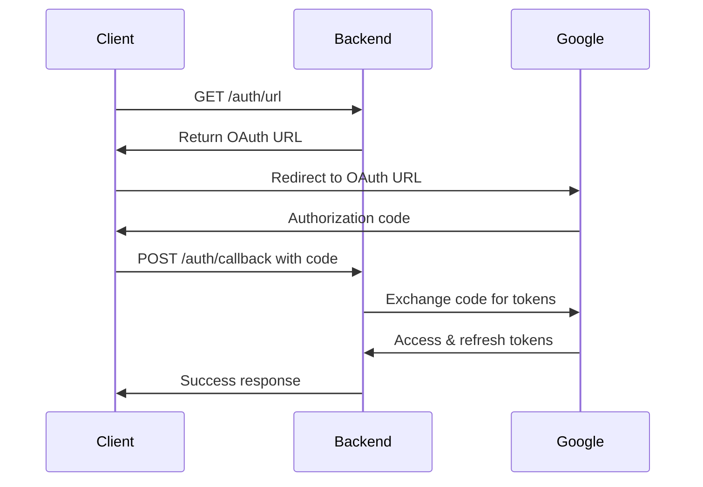

# ClickGuard Backend - Technical Documentation

## Table of Contents

1. [Architecture Overview](#architecture-overview)
2. [Code Structure](#code-structure)
3. [API Implementation](#api-implementation)
4. [Authentication Flow](#authentication-flow)
5. [Google Ads Integration](#google-ads-integration)
6. [Tracker Module](#tracker-module)
7. [Security Implementation](#security-implementation)
8. [Error Handling](#error-handling)
9. [Performance Considerations](#performance-considerations)
10. [Development Guidelines](#development-guidelines)
11. [Deployment Architecture](#deployment-architecture)

## Architecture Overview

### System Architecture

The ClickGuard Backend follows a **modular, layered architecture** with clear separation of concerns:

```
┌─────────────────────────────────────────────────────────────┐
│                    Presentation Layer                       │
│  ┌─────────────────┐  ┌─────────────────┐  ┌──────────────┐ │
│  │   HTTP Routes   │  │  Middleware     │  │  Validation  │ │
│  └─────────────────┘  └─────────────────┘  └──────────────┘ │
└─────────────────────────────────────────────────────────────┘
┌─────────────────────────────────────────────────────────────┐
│                    Business Logic Layer                     │
│  ┌─────────────────┐  ┌─────────────────┐  ┌──────────────┐ │
│  │   Services      │  │  Controllers    │  │  Utilities   │ │
│  └─────────────────┘  └─────────────────┘  └──────────────┘ │
└─────────────────────────────────────────────────────────────┘
┌─────────────────────────────────────────────────────────────┐
│                    Data Access Layer                        │
│  ┌─────────────────┐  ┌─────────────────┐  ┌──────────────┐ │
│  │   API Clients   │  │  External APIs  │  │  File System │ │
│  └─────────────────┘  └─────────────────┘  └──────────────┘ │
└─────────────────────────────────────────────────────────────┘
```

### Design Patterns

1. **Module Pattern**: Each feature is encapsulated in its own module
2. **Service Layer Pattern**: Business logic is separated from route handlers
3. **Repository Pattern**: Data access is abstracted through client interfaces
4. **Middleware Pattern**: Cross-cutting concerns are handled by middleware

## Code Structure

### Directory Organization

```
apps/backend/
├── server.js                 # Application entry point
├── package.json              # Dependencies and scripts
├── .env                      # Environment variables (not in git)
├── .env.example              # Environment template
├── .gitignore                # Git ignore rules
└── src/
    ├── app.js                # Express application setup
    ├── modules/              # Feature modules
    │   └── google-ads/       # Google Ads integration module
    │       ├── api/          # API client layer
    │       │   ├── client.js     # Google Ads API client
    │       │   ├── customer.js   # Customer operations
    │       │   ├── report.js     # Report generation
    │       │   └── index.js      # Module exports
    │       ├── auth/         # Authentication layer
    │       │   ├── service.js    # OAuth2 service
    │       │   └── routes.js     # Auth routes
    │       ├── service.js    # Business logic service
    │       └── routes.js     # API routes
    ├── services/             # Shared business services
    ├── models/               # Data models
    ├── config/               # Configuration files
    ├── workers/              # Background workers
    ├── utils/                # Utility functions
    └── api/                  # API routes and controllers
```

### Module Structure

Each module follows a consistent structure:

```
module/
├── api/              # External API integration
├── auth/             # Authentication logic
├── service.js        # Business logic
├── routes.js         # HTTP routes
└── index.js          # Module exports
```

## API Implementation

### Route Structure

All routes follow RESTful conventions:

```javascript
// Base route: /api/v1/google-ads
router.get('/status', handler);           // GET resource
router.post('/test-connection', handler); // POST action
router.get('/accounts', handler);         // GET collection
router.get('/account/:id/info', handler); // GET specific resource
```

### Response Format

Standardized response format:

```javascript
// Success Response
{
  "success": true,
  "data": { ... },
  "timestamp": "2024-01-01T00:00:00.000Z"
}

// Error Response
{
  "success": false,
  "error": "Error message",
  "details": "Detailed error information",
  "timestamp": "2024-01-01T00:00:00.000Z"
}
```

### Request Validation

Input validation is handled at the route level:

```javascript
router.get('/account/:accountId/info', async (req, res) => {
  const { accountId } = req.params;
  
  if (!accountId) {
    return res.status(400).json({
      error: 'Account ID is required'
    });
  }
  
  // Continue with valid request
});
```

## Authentication Flow

### OAuth2 Implementation

The authentication system implements the OAuth2 authorization code flow:



### Token Management

```javascript
// Token storage in file system
const tokenPath = path.join(__dirname, 'token.json');

// Save tokens
fs.writeFileSync(tokenPath, JSON.stringify(tokens));

// Load tokens
const token = JSON.parse(fs.readFileSync(tokenPath, 'utf8'));
```

### Security Considerations

1. **Token Storage**: Tokens are stored securely in file system
2. **Token Refresh**: Automatic refresh token handling
3. **Scope Validation**: Proper OAuth2 scope verification
4. **Error Handling**: Graceful handling of expired tokens

## Google Ads Integration

All Google Ads credentials (client ID, client secret, developer token, redirect URIs, etc.) **must be set via environment variables**. Do not use client_secret.json or any file-based secrets in production. See .env.example for required variables.

#### Example Required Environment Variables
```
GOOGLE_ADS_CLIENT_ID=your-google-oauth-client-id.apps.googleusercontent.com
GOOGLE_ADS_CLIENT_SECRET=your-google-oauth-client-secret
GOOGLE_ADS_DEVELOPER_TOKEN=your-google-ads-developer-token
GOOGLE_ADS_MCC_ID=your-google-ads-mcc-id
GOOGLE_ADS_REDIRECT_URIS=urn:ietf:wg:oauth:2.0:oob
```

### API Client Architecture

```javascript
// Google Ads API Client
const googleAdsClient = new GoogleAdsApi({
  client_id: process.env.GOOGLE_ADS_CLIENT_ID,
  client_secret: process.env.GOOGLE_ADS_CLIENT_SECRET,
  developer_token: process.env.GOOGLE_ADS_DEVELOPER_TOKEN,
});
```

### Customer Management

```javascript
// Customer creation and management
function getCustomer({ customerId, refreshToken, loginCustomerId }) {
  return googleAdsClient.Customer({
    customer_id: customerId,
    refresh_token: refreshToken,
    login_customer_id: loginCustomerId,
  });
}
```

### Query Execution

```javascript
// GAQL (Google Ads Query Language) execution
async function runQuery({ customerId, refreshToken, loginCustomerId, query }) {
  const customer = getCustomer({ customerId, refreshToken, loginCustomerId });
  return await customer.query(query);
}
```

### Error Handling

```javascript
try {
  const response = await customer.query(query);
  return response;
} catch (error) {
  if (error.message.includes('invalid_grant')) {
    throw new Error('The refresh token is invalid or expired. Please re-authenticate.');
  }
  throw new Error(`Failed to run Google Ads query: ${error.message}`);
}
```

## Tracker Module

The **Tracker Module** provides a lightweight, plug-and-play solution for collecting user IP, session, and page analytics from any website.

#### Features
- IP Address collection (IPv4/IPv6 supported)
- Session tracking with unique session IDs
- Automatic page view analytics
- Device fingerprinting (browser, language, timezone, canvas)
- IP enrichment (geo, ISP, org via ip-api.com)
- In-memory device frequency and /16 subnet fraud detection
- Rule engine for fraud analysis (partial-match allowlist, device frequency, /16 subnet)
- Step-by-step debug logging for every analysis stage (colored output, only relevant IP/proxy info, no device details)
- In-memory storage (no database required)
- Easy integration via a script tag
- Built-in test page for validation

#### Analysis Pipeline
1. **Tracking data received**: All tracker data is processed on arrival.
2. **IP enrichment**: The backend fetches geolocation/ISP info from ip-api.com.
3. **Device fingerprinting**: A SHA-256 hash is generated from browser, language, timezone, and canvas fingerprint.
4. **Frequency & subnet tracking**: In-memory counters track device and /16 subnet activity.
5. **Rule engine**: Applies fraud rules (allowlist, device frequency, /16 subnet fraud) and returns a decision.
6. **Debug logging**: Each step is logged for transparency. Blocked logs show only IP/proxy info, with colored output.

#### Deployment
See the main backend [README.md](./README.md) for deployment instructions and best practices.

### API Endpoints
- `POST /api/v1/tracker` — Receives tracking data from the client script, runs the analysis pipeline, and logs all steps.
- `GET /api/v1/tracker/stats` — Returns basic in-memory tracking statistics.
- `GET /api/v1/tracker/script` — Serves the tracking JavaScript (`clickguard-tracker.js`).
- `GET /api/v1/tracker/test` — Serves a test HTML page (`test-tracker.html`) for local or remote testing.

### Fraud Detection Rules
- **IP Type Analysis**: Blocks cloud/hosting IPs (OVH, AWS, Google Cloud, etc.)
- **Device Frequency Analysis**: Blocks if the same device fingerprint is seen >3 times
- **CIDR Range Analysis**: Blocks if >2 frauds are detected from the same /24 subnet

### File Structure
```
modules/tracker/
├── index.js              # Module exports
├── routes.js             # API routes
├── controller.js         # Request handlers (handles IP extraction, etc.)
├── service.js            # In-memory storage and analytics
├── public/
│   ├── clickguard-tracker.js   # Client-side tracking script
│   └── test-tracker.html       # Test/demo page
└── README.md             # Module documentation
```

### Notes
- For production, serve the backend and script over HTTPS.
- Update CORS policy as needed for your domains.
- For local testing, use LAN IP or tunneling (e.g., ngrok) for cross-device access.

For more details, see `modules/tracker/README.md` and the code comments in each file.

#### Tracker Script Endpoint

The tracker script is universal and endpoint-agnostic. It automatically detects the backend endpoint from its own src URL. No manual endpoint configuration is needed. You can use the same script tag on any site, and it will always POST to the correct backend.

## Security Implementation

### Environment Variable Security

```